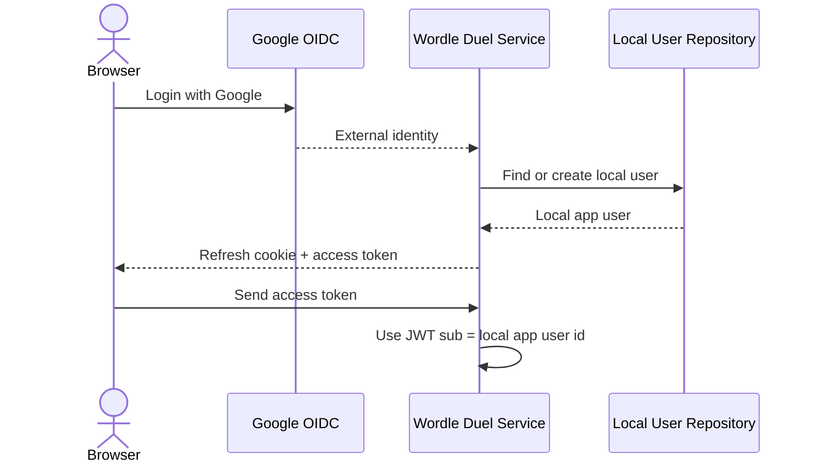

# Auth Flow Sequence

High-level view of the current auth flow:

- Google identity is used during login reconciliation.
- The local app user id is the canonical identity inside the system.
- Access tokens use the local app user id as `sub`.

## Identity Model

- External identity: Google `sub`
- Login reconciliation data: Google `sub`, email
- Internal canonical identity: `app_user.id`
- JWT subject (`sub`): `app_user.id`
- Email claim: profile data only
