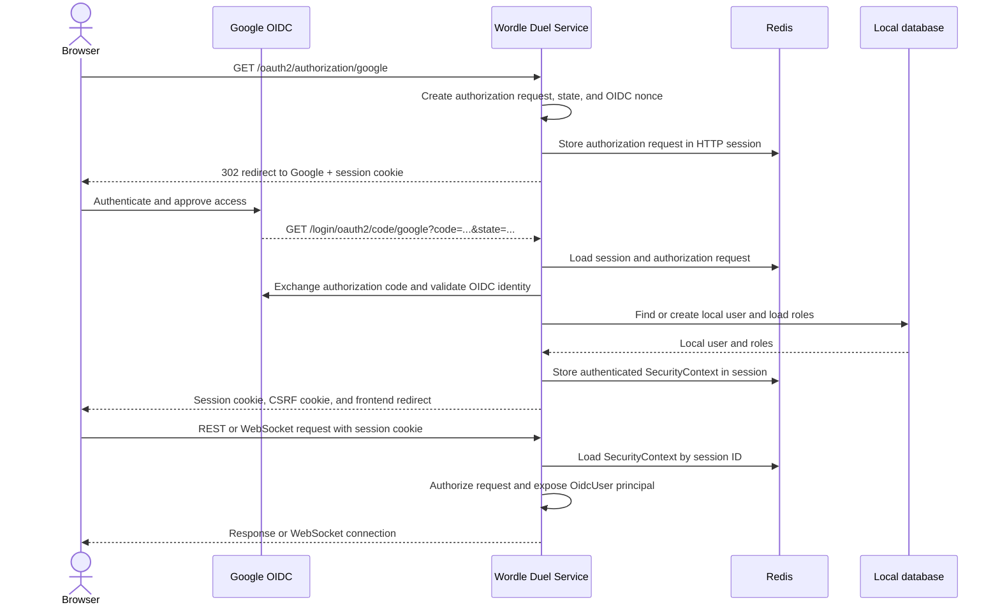

# Authentication Flow

The service uses Google OIDC for login and a server-side Spring Security session stored in Redis.
The local
`app_user.id` is the canonical application identity.


```mermaid
sequenceDiagram
    actor Browser
    participant Google as Google OIDC
    participant Service as Wordle Duel Service
    participant Redis
    participant SQL as Local database
    Browser ->> Service: GET /oauth2/authorization/google
    Service ->> Service: Create authorization request, state, and OIDC nonce
    Service ->> Redis: Store authorization request in HTTP session
    Service -->> Browser: 302 redirect to Google + session cookie
    Browser ->> Google: Authenticate and approve access
    Google -->> Service: GET /login/oauth2/code/google?code=...&state=...
    Service ->> Redis: Load session and authorization request
    Service ->> Google: Exchange authorization code and validate OIDC identity
    Service ->> SQL: Find or create local user and load roles
    SQL -->> Service: Local user and roles
    Service ->> Redis: Store authenticated SecurityContext in session
    Service -->> Browser: Session cookie, CSRF cookie, and frontend redirect
    Browser ->> Service: REST or WebSocket request with session cookie
    Service ->> Redis: Load SecurityContext by session ID
    Service ->> Service: Authorize request and expose OidcUser principal
    Service -->> Browser: Response or WebSocket connection
```

## Login

1. `GET /oauth2/authorization/google` is handled by Spring Security. The Google client configuration
   provides the client ID, server-side client secret, `openid profile email` scopes, and callback
   URI
   `/login/oauth2/code/google`.
2. Spring generates an authorization request with a random `state` and OIDC `nonce`. The request is
   stored in the HTTP session, so Redis creates a session record and the browser receives an opaque
   session cookie.
3. Google authenticates the user and calls back with a short-lived authorization `code` and the
   original `state`.
4. Spring loads the pending request from Redis, verifies `state`, exchanges the code with Google,
   and validates the OIDC identity and nonce.
5. `OAuthUserService` extracts the Google `email`, `sub`, full name, and picture. The local
   repository:
    - finds the user by `google_sub`;
    - otherwise links an existing user with the same email; or
    - creates a new user with a random UUID.
6. The local profile is updated, the `USER` role is ensured, and local roles become `ROLE_*`
   authorities.
7. The authenticated principal is rebuilt as an `OidcUser` with the Google claims plus:

   ```text
   app_user_id=<local app_user.id>
   ```

8. Spring stores the authenticated `SecurityContext` in the Redis session and redirects to the
   configured frontend URL. The session ID is normally changed during authentication for
   session-fixation protection.

## Storage

| Data                                                   | Stored in                                          | Purpose                                                                       |
|--------------------------------------------------------|----------------------------------------------------|-------------------------------------------------------------------------------|
| Session ID                                             | Browser cookie; session data in Redis              | Identifies the server-side session                                            |
| OAuth authorization request, `state`, and `nonce`      | Redis session                                      | Correlates the Google callback with the login attempt; removed after callback |
| `SecurityContext`, `OidcUser`, claims, and authorities | Redis session                                      | Authenticates later requests                                                  |
| Local user, Google `sub`, profile, and roles           | SQL tables `app_user`, `role`, and `app_user_role` | Application identity and authorization data                                   |
| `app_user_id`                                          | OIDC principal attributes and local SQL ID         | Connects Google identity to application data                                  |
| CSRF token                                             | Browser cookie `WD-XSRF-TOKEN`                     | Double-submit protection for state-changing requests                          |
| Google authorized client tokens                        | Spring’s default in-memory client store            | Optional provider access/refresh tokens; not used as API credentials          |

The production session cookie is `__Host-wd_session` with `HttpOnly`, `Secure`, `SameSite=Lax`,
`Path=/`, and a 180-day max age. Development uses `wd_session` with `Secure=false`. The configured
server-side session idle timeout is also 180 days.

## Request authentication

The browser sends the session cookie automatically. Spring Session uses its value to load the
session from Redis; Spring Security then loads the `SecurityContext` and authenticates the request.

- `/api/**` requires an authenticated session.
- `/admin/**` additionally requires `ROLE_ADMIN`.
- `/ws` and `/ws/**` require an authenticated session during the WebSocket handshake.
- Unauthenticated protected requests return `401`; authenticated users without the required admin
  role return `403`.

Controllers receive the `OidcUser` principal. `AuthenticatedUserResolver` extracts `app_user_id`,
email, and local roles. Game and profile services use the local ID; Google is not contacted on each
request.

The WebSocket handshake uses the same session cookie and inherits its authenticated principal. After
the handshake, STOMP messages use the identity attached to that connection.

## CSRF

`GET` requests need the session cookie only. State-changing requests must also send the raw value
from the
`WD-XSRF-TOKEN` cookie in:

```text
X-WD-XSRF-TOKEN: <cookie value>
```

The CSRF cookie is readable by frontend JavaScript; the session cookie remains `HttpOnly`. The
logout endpoint also requires CSRF protection.

## Logout and expiry

`POST /auth/logout` invalidates the server-side session, removes the authentication from Redis,
clears the session cookie and CSRF cookie, and returns `204 No Content`.

If the Redis session expires or is unavailable, the session cookie no longer authenticates the
request and the user must log in again.
