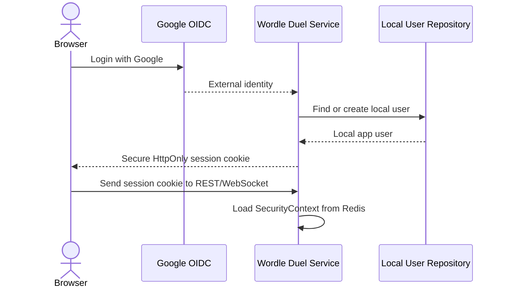

# Auth Flow Sequence

High-level view of the current auth flow:

- Google identity is used during login reconciliation.
- The local app user id is the canonical identity inside the system.
- The authenticated principal is stored in a Redis-backed Spring Security session.

```mermaid
sequenceDiagram
    actor Browser
    participant Google as Google OIDC
    participant Service as Wordle Duel Service
    participant UserRepo as Local User Repository
    Browser ->> Google: Login with Google
    Google -->> Service: External identity
    Service ->> UserRepo: Find or create local user
    UserRepo -->> Service: Local app user
    Service -->> Browser: Secure HttpOnly session cookie
    Browser ->> Service: Send session cookie to REST/WebSocket
    Service ->> Service: Load SecurityContext from Redis
```

## Identity Model

- External identity: Google `sub`
- Login reconciliation data: Google `sub`, email
- Internal canonical identity: `app_user.id`
- Local app user id: `app_user.id` in the OIDC principal
- Email claim: profile data only
